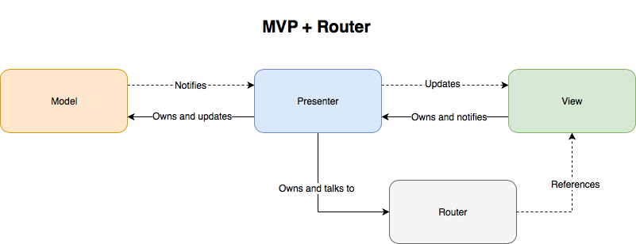
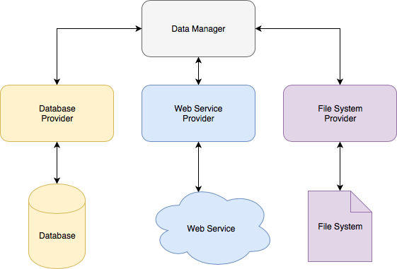
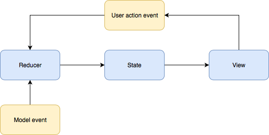

[< Back](../README.md)

# Architecture

Here you will find the general application architecture described in more details. Once again, we are trying to reach a certain level of similarity with the approach taken by our team on Android, yet this is not the main goal.

This page is updated over time to reflect changes to the recommended approach.

## Table of contents

* [Pattern](#pattern)
  * [Model](#model)
  * [View](#view)
    * [Flow](#flow)
    * [UIView and UIViewController](#uiview-and-uiviewcontroller)
    * [Formatting and localization](#formatting-and-localization)
    * [Self-updating views](#self-updating-views)

## Pattern



In general, our project follow the __MVP__ pattern where the three letters stand for the following layers:

* __Model__ - contains the model objects, providers, data managers, DTOs, mapping code, etc.
* __View__ - contains the user interface and consumes the user actions.
* __Presenter__ - links the above two together by feeding data into the __View__ and performing actions in response to events, received from the __View__.

Router is an additional entity in this setup, responsible for performing navigation between different screens. This is completely optional and can be included into either the __View__ or __Presenter__.

**Important note**

>Different tutorials over the web put a big emphasis on so-called __testability__ and __reusability__ when talking about patterns. We believe that while both things are important, they are hard to achieve on practice with most of the presentation code being one-to-one coupled with the view code. This is why the entire reason why we are following a specific pattern is because we want to achieve a separation of concerns to make the code cleaner and easier to read.

### Model



The diagram above represents a sample structure of the __Model__. It is very important to understand that different apps require a different structure and there is no silver bullet here too. In a simple project the entire model may be represented by a single array, while in more complex apps it can be an entire hierarchy of objects, responsible for different areas.

In this article we are going to cover a more complex case where an app is talking to different __Data sources__, including Web Service (WS), Database (DB) or File System (FS).

Above all the data sources lie the __Data Providers__, that incapsulate the details about how to access or write the data. There shall be no universal interface for a provider, because the sources they are built on top may vary significantly and attempts to make one will turn into a terrible headache =].

The providers are consumed by the __Data Manager__, which encapsulates the data-related business logic. Data manager serves as an interface for the __Model__ and is used from the __Presenter__. In certain cases a data manager will talk to different data providers while executing a single action. It is most convenient to organize such communication with the use of [Functional Reactive Programming](https://en.wikipedia.org/wiki/Functional_reactive_programming). If your are new to reactive programming, it can be complicated to get it at first. We suggest walking through the articles referenced in [Helpful links](./HelpfulLinks.md).

One thing, not represented in the diagram is the __Entities__. These objects are the semantical bits your application operates on. They can represent real-life objects or people, documents, etc. There are no special constrains on their implementation, but usually they classes or structures that contain no business logic, but rather encapsulate a set of properties.

Most of the time it is not convenient to have a single data manager, taking care of the entire app's data flows, because such data managers become big and messy. Instead much better is to have multiple data managers, each of which responsible for its own area. The granularity depends on the app, yet as a start you may try having a data manager per entity type.

It is not a good idea to have the data providers create the stores themselves or to have the data managers instantiate the data providers. Instead they need to get such dependencies from the outside at the time of creation. This approach is called __Dependency Injection__ and is covered in more detail in the [corresponding section](#dependency-injection).

### View

View layer is mainly represented by the `UIView` and `UIViewController` classes. This is a very powerful set of tools and when applied wisely, can lead to a clean and easy to understand structure.

As seen on the first diagram, __View__ owns the __Presenter__, so there is not much need to hide the type of the presenter behind a protocol. On the other hand, the presenter sees the view through a protocol.

#### Flow

View layer is what our users will actually see, so making it good is critical for every mobile application. A comprehensive overview of different approaches of organizing the data flows is out of scope of this page, so we will cover only the recommended one.



Basically the idea is to reduce the number of paths through which a view can be changed to just one. It all starts with an __Event__ being emitted: it can be the user tapping some button, or some notification arriving. These events are intercepted by the __Reducer__ that processes them and updates the view's __State__. As soon as the state changes, the view updates itself to match the new state.

This approach influences the way you engineer your presenters and your views.

Example:

**Preferred**

```swift
class ButtonView: UIView {

    // MARK: - Public properties

    var showsButton: Bool = false { didSet { updateView() } }

    // MARK: - Outlets

    @IBOutlet private(set) weak var button: UIButton!

    @IBOutlet private var buttonLeadingConstraint: NSLayoutConstraint!

    // MARK: - Public API

    override func awakeFromNib() {
        super.awakeFromNib()
        updateView()
    }

    // MARK: - Private API

    private func updateView() {
        button.isHidden = !showsButton
        buttonLeadingConstraint.isActive = showsButton
    }

}
```

**Not preferred**

```swift
class ButtonView: UIView {
  @IBOutlet private(set) weak var button: UIButton!
  @IBOutlet private var buttonLeadingConstraint: NSLayoutConstraint!

  override func awakeFromNib() {
      super.awakeFromNib()
      showButton()
  }
  func showButton() {
    button.isHidden = false
    buttonLeadingConstraint.isActive = true
  }
  func hideButton() {
    button.isHidden = true
    buttonLeadingConstraint.isActive = false
  }
}
```

#### UIView and UIViewController

It is ultimately important to understand the difference between these two and use both to take the most out of the platform.

**What is a UIView?**

In fact this is that "dumb view" everyone is talking about. Views expose state that is changed from the outside and emit user-action-related events (usually through delegation or target-action mechanism, but it can also be achieved using reactive programming).

Some views are just a combination of other views. They don't expose a state property, but rather give access to their outlets.

Some views, like text fields, break the flow by changing their state directly. This problem is described and solved [here](#self-updating-views).

**Ok. What is the UIViewController then?**

First of all, unless you specify a custom class for its view (which nobody does), it is also a view itself in terms, described above.

The difference is that they are slightly more intelligent, then `UIView`'s:

* They create and keep a strong reference to the presenter;
* They receive the lifecycle events and perform segues;
* In case of bindings they perform the binding between the presenter's observables and the subviews;
* They perform __formatting__ of data, received from the presenter;
* They manage localization;

Lets focus on the last two bullets:

#### Formatting and localization

It is a matter of preference to decide whether the __Presnter__ or the __View__ is responsible for making the user-facing strings out of data. In my opinion if this thing is done in the presenter, it will naturally reveal too many details about the view to the presenter, which will hurt the entire concept.

If formatting, which includes combining two string into one, is performed in the view controller, it is not possible (and not logical) to apply localization in the presenter, therefore this task should also be done in the view controller.

#### Self-updating views

There is a number of system views, that change their state directly in response to the user's actions. For example, `UITextField` changes its `text` property as the user types or `UISegmentedControl` changes the selection when the user taps it. Other examples are `UITextView`, `UISlider`, `UISwitch`, `UIDatePicker`, etc.

This breaks the defined [Flow](#flow) by introducing multiple paths through which a view modification can happen, leading to "multiple sources of truth" and potential bugs.

To solve this problem we have (at least =]) two options:

* Modify the behaviour of all such elements, making them only send the events without changing their state.
* Make sure the __Reducer__ gets the event, containing the new value before the user sees the change and either synchronizes itself with it or resets the view's state with a new appropriate value.

Both solutions are completely viable, but with the use of bindings it is particularly easy to achieve the second one. Beneficial here is that you don't need to fight with the platform which is usually a good thing.

[This page](https://reactjs.org/docs/forms.html) describes how the very same problem is solved in React.

## Credits

Ⓒ Devoteam Digital Factory 2018
