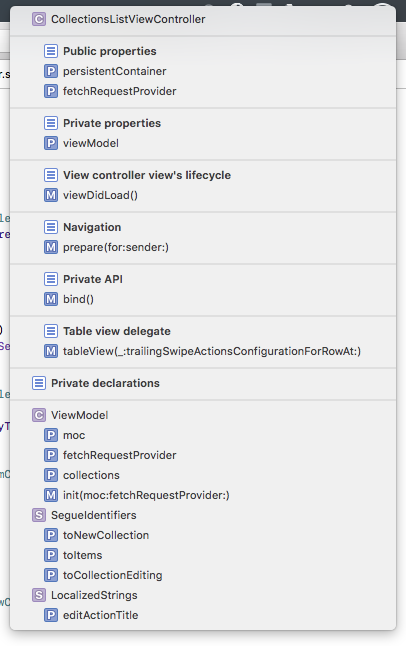

[< Back](../README.md)

# Style guide

This page tries to give a comprehensive description of the code culture that is reinforced in our projects along with some common mistakes frequently found when doing code review =]

## Table of contents

* [Basics](#basics)
  * [Code organization](#code-organization)
  * [Spacing](#spacing)
  * [Line breaks](#line-breaks)
  * [Optionals](#optionals)
  * [Access control](#access-control)
* [Linting](#linting)
* [Example](#exaple)

## Basics

In most cases it is more helpful to use some generally accepted approach, rather than re-inventing the wheel, and here it is also like this. Unless stated otherwise in this document, we follow [this style guide](https://github.com/raywenderlich/swift-style-guide). The guide contains most of the important rules that improve the readability and consistence of code. In the following sections you will find things that are different from it.

### Code organization

Ray's team suggests to organize code with extensions and at first it seems to be a good idea. But unfortunately it has a significant problem in it. Due to the [method dispatch mechanism](https://www.raizlabs.com/dev/2016/12/swift-method-dispatch/) used in Swift, at times it may not be possible to override methods, e.g. the the protocol conformance code, declared in an extension, in a subclasses. To work around it, you will have to move such code back into the class declaration, thus making your code inconsistent.

Therefore we suggest to use `MARK`'s to organize your classes. In our projects we have the following default sections:

```swift
// MARK: - Public properties
// MARK: - Private properties
// MARK: - Initialization
// MARK: - Public API
// MARK: - Private API
```

##### Tips:

* If a property is declared as `private(set)`, it shall still go into the __Public properties__ section since it is visible outside the class.
* If you are overriding some public method in a subclass, it shall still remain in the __Public API__ section. Do not create an __Overrides__ section or similar.
* Always specify a restrictive access modifier when adding a new partly or completely private class member.
* If a type has public or private nested declarations, they shouldn't contain sections inside them and must appear at the beginning of their encapsulating type declaration above the __Public properties__ section with the public types going first.
* It is OK to leave the default sections empty, though it is not a mistake to remove such `MARK`.

Protocol conformance code goes after the __Private API__ section. Each such section must have its own `MARK` and have a sentence-like naming. There is no strict rule in which order the protocol conformance sections need to appear. Example:

```swift
// MARK: - Table view data source

override func tableView(_ tableView: UITableView, numberOfRowsInSection section: Int) -> Int {
    return 1
}

// MARK: - My view delegate

func myViewDidRequestResetting(_ view: MyView) {
    data.reset()
}
```

Usually we declare some utility private types or extensions. For example, we may have a private `struct` that contains segue identifiers for a view controller. We put such declarations below the main class declaration, separating the private part with a special mark:

```swift
// MARK: - Private declarations -
```

Note that this `MARK` has a trailing dash. This helps to visually separate this section when viewing the overview dropdown in Xcode:



Note that some standard types like `UIViewController` or `UIView` have their own additional sections. Refer to [Snippets](./Snippets.md) to find out more.

### Spacing

We use a default value of 4 spaces instead of 2, suggested by the [guide](https://github.com/raywenderlich/swift-style-guide). This is the Xcode's default and in most cases is more pleasant to iOS developer's eyes.

### Line breaks

We do not allow holes in our code, which means it is only allowed to have one empty line in a row and only in some cases. Remember, your code is a work of art and shall be treated as such.

We don't allow empty lines inside methods. If you think some part of your method is logically enclosed, consider either putting a comment into that line, describing why this code is there or refactoring it into several methods:

**Preferred:**
```swift
func drawDefaultImage() {
    let image = createDefaultImage()
    draw(image)
}

func createDeafultImage() -> UIImage {
  <...>
}

func draw(_ image: UIImage) {
  <...>
}
```

**Not preferred:**
```swift
func drawDefaultImage() {

    let size = CGSize(width: 200, height: 200)
    UIGraphicsBeginImageContextWithOptions(size, true, 1.0)
    <...>
    UIGraphicsEndImageContext()

    let renderer = Renderer()
    <...>

}
```

We use one and only one empty line to separate two members of a type from each other and from the enclosing braces.

**Preferred:**
```swift
class MyClass {

    // MARK: - Public properties

    var numberOfRows: Int = 0

    var reloadsAutomatically: Bool = true

    // MARK: - Public API

    func reload() {
      <...>
    }

    func object(at index: Int) -> Object {
      <...>
    }

}
```

**Not preferred:**
```swift
class MyClass {
    // MARK: - Public properties
    var numberOfRows: Int = 0

    var reloadsAutomatically: Bool = true
    // MARK: - Public API
    func reload() {
      <...>
    }
    func object(at index: Int) -> Object {
      <...>
    }
}
```

> __Note__: Homogeneous properties like `@IBOutlet`'s can be declared without an empty line between each other.

### Optionals

Generally you __must__ avoid force unwrapping optionals even if you are 100% sure that there is a value inside.

**Preferred:**
```swift
let value: Int? = 0
if let value = value {
  print(value.description)
}
let nonOptionalValue = value ?? 0
label.text = value?.description
```

**Not preferred:**
```swift
let value: Int? = 0
print(value!.description)
label.text = String(describing: value!)
```

> __Note__: There are some rare cases when force unwrapping is inevitable, but most of the time it is when some Objc APIs are returning an optional, when they shouldn't. It is still a good idea though to use `if let` there as well.

### Access control

We always hide the implementation details of our objects, so please take the following tips into account when implementing your next object:

* We always mark `@IBAction`s as `private` as they should never called directly or exposed to the class consumers.
* We mark `@IBOutlet`s as `private` in view controllers and `private(set)` in views.
* We mark publicly read-only properties `private(set)` and put them into `Public properties` section.

## Linting

We are very excited to reduce the headache of manually maintaining the consistent coding style by adding the [SwiftLint](https://github.com/realm/SwiftLint) into our projects. But is hasn't happened yet, so:

[TBD]

## Example

In [this gist](https://gist.github.com/danchoys-d2f/e3bb6623e38276383cbba5fc27cd89b4) you will find a complete implementation of a view controller built with the above rules. Note that code is referencing a third-party library, so please focus on the style rather than architecture.

## Credits

Ⓒ Devoteam Digital Factory 2018
